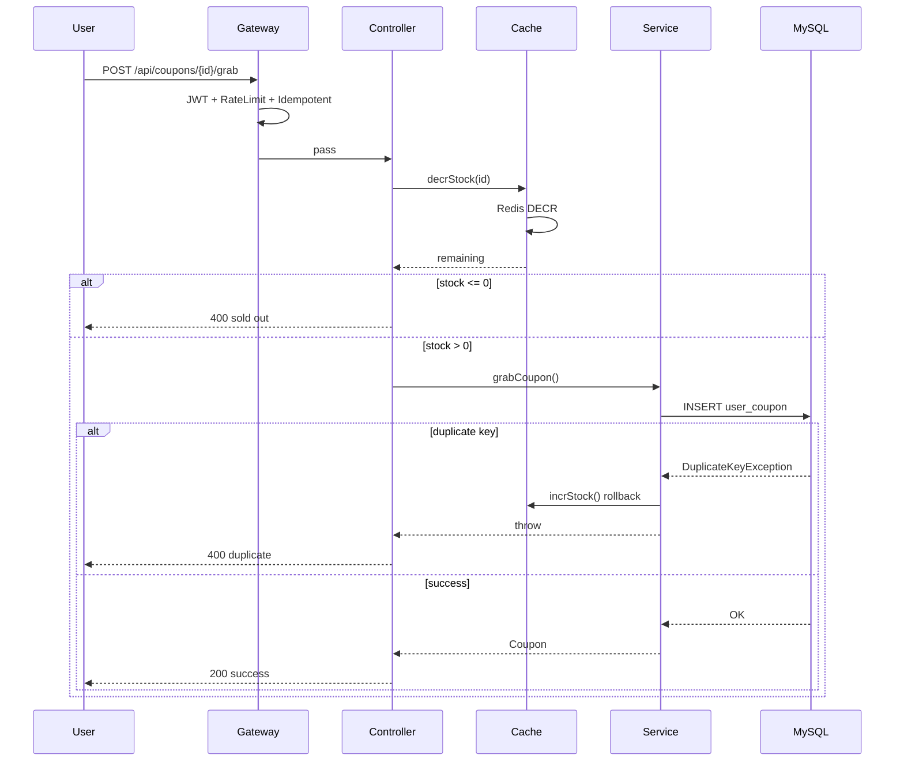
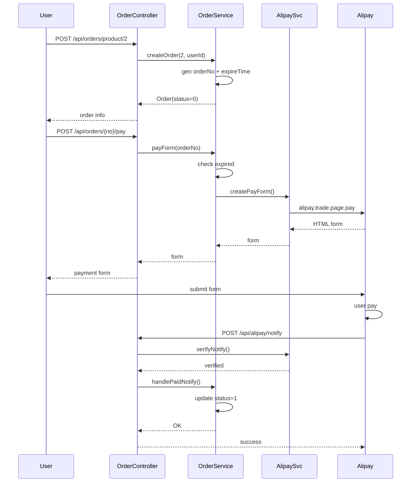

# 项目接口测试状态

> 测试时间：2026-05-19 | 项目状态：✅ 运行中（后端 8080 / 前端 3000）
> 测试用户：`admin` / `123456` | 测试结果：**全量通过** ✅

## 项目概览

**统一返回格式：** 所有接口返回标准结构 `{"code": 200, "message": "操作成功", "data": { ... }}`

成功响应：
```json
{"code": 200, "message": "操作成功", "data": { "id": 1, "name": "..." }}
```

异常响应：
```json
{"code": 404, "message": "资源不存在", "data": null}
```

| code | message | 触发条件 |
|:----:|---------|----------|
| 200 | 操作成功 | 正常返回 |
| 201 | 创建成功 | 资源创建成功 |
| 400 | 请求参数错误 / 业务拒绝 | 参数校验失败、重复抢券、券已抢完、订单过期 |
| 401 | 未授权 | Token 缺失、无效或已登出 |
| 403 | 无权限 | 权限不足 |
| 404 | 资源不存在 | 查询/删除不存在的 ID |
| 429 | 请求过于频繁 / 已被拉黑 | 超过限流阈值或被加入黑名单 |
| 500 | 服务器内部错误 | 未捕获的异常 |

**安全规则：**

| 规则 | 说明 |
|------|------|
| `POST /api/auth/login, /logout` | 公开 |
| `GET /api/products/**`、`GET /api/coupons/**` | 公开 |
| 其余接口（含 `/api/users/**`） | 需 Bearer Token |
| 登出后 Token 立即失效 | 返回 401 |

## API 接口

| 模块 | 方法 | 路径 | 认证 |
|------|------|------|------|
| 认证 | POST | `/api/auth/login` | 否 |
| 认证 | POST | `/api/auth/logout` | 否 |
| 认证 | GET | `/api/auth/api/hello` | 是 |
| 商品 | GET | `/api/products` | 否 |
| 商品 | GET | `/api/products/{id}` | 否 |
| 商品 | POST | `/api/products` | 是 |
| 商品 | PUT | `/api/products/{id}` | 是 |
| 商品 | DELETE | `/api/products/{id}` | 是 |
| 优惠券 | GET | `/api/coupons` | 否 |
| 优惠券 | GET | `/api/coupons/{id}` | 否 |
| 优惠券 | POST | `/api/coupons` | 是 |
| 优惠券 | PUT | `/api/coupons/{id}` | 是 |
| 优惠券 | DELETE | `/api/coupons/{id}` | 是 |
| 优惠券 | POST | `/api/coupons/{id}/grab` | 是 |
| 用户 | GET | `/api/users` | 是 |
| 用户 | PUT | `/api/users/{id}` | 是 |
| 订单 | POST | `/api/orders/product/{productId}` | 是 |
| 订单 | GET | `/api/orders/{orderNo}` | 是 |
| 订单 | POST | `/api/orders/{orderNo}/pay` | 是 |
| 支付宝 | POST | `/api/alipay/notify` | 否（回调） |

**异常覆盖：** 密码错误 → 401，登出后访问 → 401，资源不存在 → 404，重复抢券 → 400，抢完 → 400，订单过期 → 400

## 系统架构

### 类图

```mermaid
classDiagram
    class AuthController { +login() +logout() +hello() }
    class ProductController { +list() +get() +create() +update() +delete() }
    class CouponController { +list() +get() +create() +update() +delete() +grab() }
    class OrderController { +create() +get() +pay() }
    class UserController { +list() +update() }
    class AlipayNotifyController { +handleNotify() }
    class ProductService { <<interface>> +listProducts() +getProductById() +createProduct() +updateProduct() +deleteProduct() }
    class CouponService { <<interface>> +listCoupons() +getCouponById() +createCoupon() +updateCoupon() +deleteCoupon() +grabCoupon() }
    class OrderService { <<interface>> +createOrder() +getByOrderNo() +payForm() +handlePaidNotify() }
    class AlipayService { +createPayForm() +verifyNotify() }
    class RateLimitService { +checkGrabLimit() }
    class CouponCacheService { +decrStock() +incrStock() +initStock() }
    ProductController --> ProductService
    CouponController --> CouponService
    CouponController --> RateLimitService
    OrderController --> OrderService
    AlipayNotifyController --> AlipayService
    AlipayNotifyController --> OrderService
    CouponServiceImpl --> CouponCacheService
    OrderServiceImpl --> AlipayService
    OrderServiceImpl --> ProductService
```



### 抢券时序



### 支付时序



## 业务功能

### 抢优惠券

**安全设计（3 层防护）：**
- **① 防抖** `@Idempotent(ttl=2s)` — Redis SET NX 防重复提交
- **② 限流拉黑** `RateLimitService` — 用户 5 次/分钟 或 设备 10 次/分钟，超限拉黑 30 分钟
- **③ 业务防护** — Redis Lua 原子 DECR 控制库存 + DB 唯一约束防重复领取

并发测试（20 并发同用户）：1 成功、重复拒绝、0 超发、0 错误 ✅

### 下单支付流程

```
用户 → 创建订单（expire_time = now + 30min）→ 获取支付宝表单 → 跳转沙箱 → 完成支付 → 异步回调更新订单
```

| 超时机制 | 实现 |
|----------|------|
| 订单过期 | 写入 `expire_time = createTime + 30min` |
| 支付前校验 | 获取表单时检查 `expire_time` |
| 批量过期 | 定时扫描标记 `status=2` |

支付宝 SDK：`alipay-sdk-java:4.9.28.ALL` | 测试页面：`http://localhost:8080/pay-test.html`

### Redis 使用

| 用途 | 数据结构 | TTL |
|------|---------|-----|
| Token 黑名单 | `auth:token:{jwt}` | 1h |
| 优惠券库存 | `coupon:stock:{id}` | 2h |
| 用户/设备限流 | `ratelimit:grab:user/{device}:{id}` | 60s |
| 黑名单 | `blacklist:grab:user/{device}:{id}` | 30min |
| 防抖锁 | `idempotent:grab:{userId}:{couponId}` | 2s |

### AOP 操作日志

`@Log` 注解 + `LogAspect` 切面，自动记录到 `sys_oper_log` 表。

覆盖 13 种场景：登录（成功/失败）、注销、CRUD 操作、抢券、支付、限流/防抖拒绝 — 全部通过 ✅

## 前端管理面板

Vue 3 + Element Plus，Vite 代理 `/api` → `localhost:8080`。启动：

```bash
cd frontend && npm install && npm run dev    # http://localhost:3000
```

| 路由 | 页面 | 说明 |
|------|------|------|
| `/login` | 登录 | admin / 123456 |
| `/dashboard` | 仪表盘 | 概览统计 |
| `/product` | 商品管理 | CRUD + 分页 |
| `/coupon` | 优惠券管理 | CRUD + 分页 |
| `/order` | 订单查询 | 管理端 |
| `/user` | 用户管理 | 列表 + 启用/禁用 |
| `/shop/products` | 商城商品 | 用户端浏览、下单、支付 |
| `/shop/coupons` | 商城优惠券 | 用户端领取 |
| `/shop/orders` | 我的订单 | 用户端查询 |

**API 文档：** Swagger UI `/swagger-ui.html` | OpenAPI JSON `/api-docs`

## 故障修复记录

| 问题 | 原因 | 修复 |
|------|------|------|
| Swagger 500 | springdoc 2.6.0 不兼容 Spring Boot 3.5.x | 升级至 2.8.12 |
| 登录 403 | 未配置 AuthenticationEntryPoint | SecurityConfig 添加 401 响应 |
| 中文乱码 | Content-Type 未指定 charset | 添加 `charset=UTF-8` |
| 新增商品 500 | 主键冲突 | 重置 AUTO_INCREMENT |
| 删除不存在商品 500 | RuntimeException 未区分 | 改为 NoSuchElementException |
| 分页 total 为 0 | 缺少 jsqlparser 分页依赖 | 添加 mybatis-plus-jsqlparser |
| 商品详情接口缺失 | Controller 缺 GetMapping | 新增查询方法 |
| 支付宝回调未更新 | notifyUrl 未写入表单 + alipayPublicKey 配置错误 | 显式 setNotifyUrl() + 改为支付宝公钥 |

**回调验证：**
```
订单 20260519225530A4B39E206A  Apple Watch S10  ¥3,199.00
→ status=1 ✅  alipayTradeNo=2026051922001428890511719692  payTime=2026-05-19 22:55:52
```
