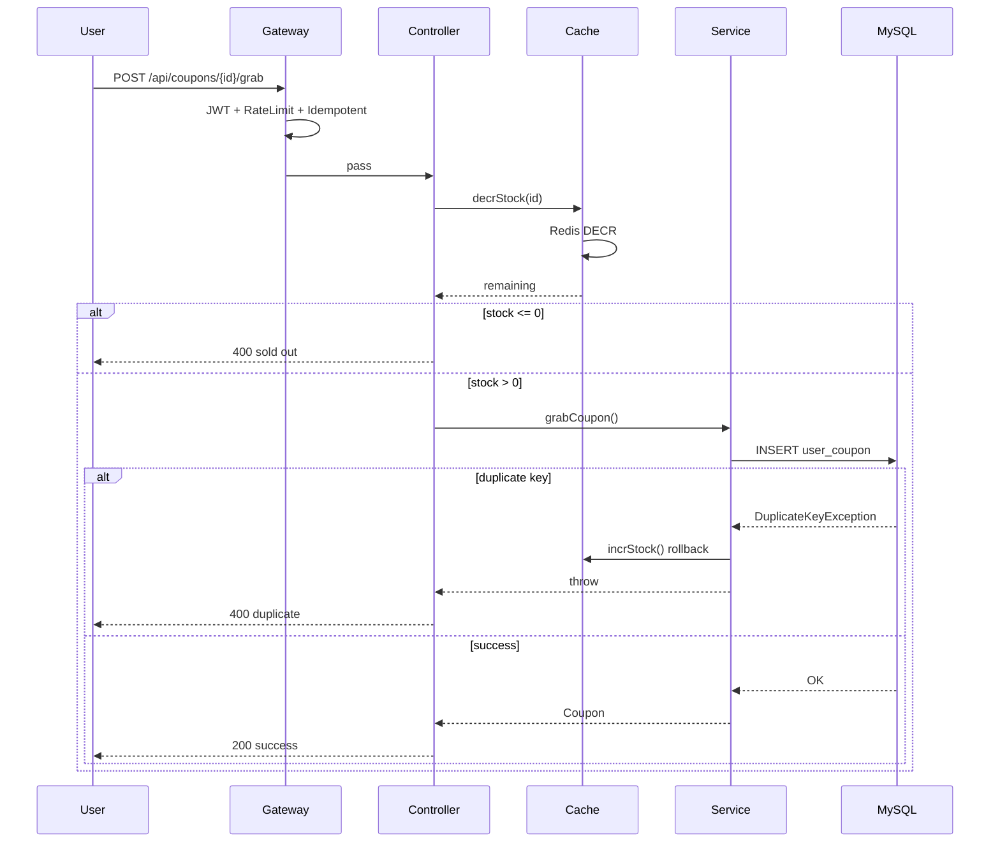
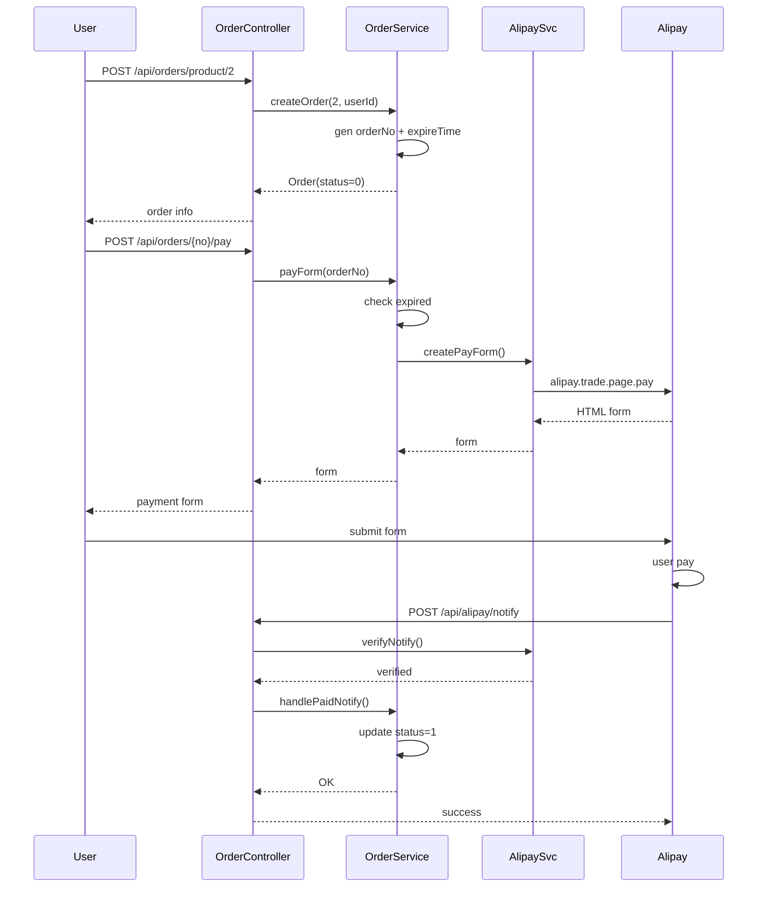

# 项目接口测试状态

> 测试时间：2026-05-19
> 项目状态：✅ 已启动（后端 8080 / 前端 3000）
> 测试用户：`admin` / `123456`
> 测试结果：**全量通过** ✅

---

## 管理前端

基于 Vue 3 + Element Plus 的若依风格管理面板。

### 启动方式

```bash
cd frontend
npm install
npm run dev        # 开发模式 http://localhost:3000
npm run build      # 构建生产包到 dist/
```

### 页面列表

| 路由 | 页面 | 说明 |
|------|------|------|
| `/login` | 登录 | 默认 admin / 123456 |
| `/dashboard` | 仪表盘 | 概览统计 |
| `/product` | 商品管理 | CRUD + 分页 |
| `/coupon` | 优惠券管理 | CRUD + 分页 |
| `/order` | 订单管理 | 按订单号查询 |
| `/user` | 用户管理 | 列表 + 启用/禁用 |
| `/shop/products` | 商城-商品 | 用户浏览、下单、支付 |
| `/shop/coupons` | 商城-优惠券 | 用户领取优惠券 |
| `/shop/orders` | 商城-订单 | 用户查询订单 |

开发模式下 Vite 自动代理 `/api` 到后端 `localhost:8080`。

---

## UML 类图

```mermaid
classDiagram
    class AuthController {
        +login() ApiResponse
        +logout() ApiResponse
        +hello() ApiResponse
    }

    class ProductController {
        +list() ApiResponse
        +get() ApiResponse
        +create() ApiResponse
        +update() ApiResponse
        +delete() ApiResponse
    }

    class CouponController {
        +list() ApiResponse
        +get() ApiResponse
        +create() ApiResponse
        +update() ApiResponse
        +delete() ApiResponse
        +grab() ApiResponse
    }

    class OrderController {
        +create() ApiResponse
        +get() ApiResponse
        +pay() ApiResponse
    }

    class UserController {
        +list() ApiResponse
        +update() ApiResponse
    }

    class AlipayNotifyController {
        +handleNotify() String
    }

    class ProductService {
        <<interface>>
        +listProducts() Page
        +getProductById() Product
        +createProduct() Product
        +updateProduct() Product
        +deleteProduct() void
    }

    class CouponService {
        <<interface>>
        +listCoupons() Page
        +getCouponById() Coupon
        +createCoupon() Coupon
        +updateCoupon() Coupon
        +deleteCoupon() void
        +grabCoupon() Coupon
    }

    class OrderService {
        <<interface>>
        +createOrder() Order
        +getByOrderNo() Order
        +payForm() String
        +handlePaidNotify() void
    }

    class AlipayService {
        +createPayForm() String
        +verifyNotify() boolean
    }

    class RateLimitService {
        +checkGrabLimit() void
    }

    class CouponCacheService {
        +decrStock() long
        +incrStock() void
        +initStock() void
    }

    class CouponServiceImpl {
        +createCoupon() Coupon
        +grabCoupon() Coupon
    }

    class OrderServiceImpl {
        +createOrder() Order
        +payForm() String
    }

    class Product {
        +Long id
        +String name
        +BigDecimal price
        +Integer stock
    }

    class Coupon {
        +Long id
        +String name
        +String code
        +Integer type
        +BigDecimal value
        +Integer usageLimit
        +Integer usedCount
    }

    class Order {
        +Long id
        +String orderNo
        +BigDecimal amount
        +Integer status
        +LocalDateTime expireTime
    }

    class UserCoupon {
        +Long id
        +Long couponId
        +Long userId
        +Integer used
    }

    ProductController --> ProductService
    CouponController --> CouponService
    CouponController --> RateLimitService
    OrderController --> OrderService
    AlipayNotifyController --> AlipayService
    AlipayNotifyController --> OrderService
    CouponServiceImpl --> CouponCacheService
    OrderServiceImpl --> AlipayService
    OrderServiceImpl --> ProductService
```



## UML 时序图

### 抢券时序



### 支付时序


```

---

## 统一返回格式

```json
{"code": 200, "message": "操作成功", "data": { ... }}
```

| code | 说明 |
|------|------|
| 200/201 | 成功 |
| 400 | 参数错误 / 业务拒绝（重复抢券、券已抢完等） |
| 401/403 | 未授权/无权限 |
| 404/500 | 资源不存在/服务器错误 |
| 429 | 请求过于频繁 / 已被拉黑 |

---

## API 端点

### 认证管理 — `/api/auth`

| 方法 | 路径 | 认证 | 结果 |
|------|------|------|------|
| POST | `/api/auth/login` | 无需 Token | ✅ |
| POST | `/api/auth/logout` | 无需 Token | ✅ |
| GET | `/api/auth/api/hello` | 需 Token | ✅ |

### 商品管理 — `/api/products`

| 方法 | 路径 | 认证 | 结果 |
|------|------|------|------|
| GET | `/api/products` | 无需 Token | ✅ |
| GET | `/api/products/{id}` | 无需 Token | ✅ |
| POST | `/api/products` | 需 Token | ✅ |
| PUT | `/api/products/{id}` | 需 Token | ✅ |
| DELETE | `/api/products/{id}` | 需 Token | ✅ |

### 优惠券管理 — `/api/coupons`

| 方法 | 路径 | 认证 | 结果 |
|------|------|------|------|
| GET | `/api/coupons` | 无需 Token | ✅ |
| GET | `/api/coupons/{id}` | 无需 Token | ✅ |
| POST | `/api/coupons` | 需 Token | ✅ |
| PUT | `/api/coupons/{id}` | 需 Token | ✅ |
| DELETE | `/api/coupons/{id}` | 需 Token | ✅ |
| POST | `/api/coupons/{id}/grab` | 需 Token | ✅ |

### 用户管理 — `/api/users`

| 方法 | 路径 | 认证 | 结果 |
|------|------|------|------|
| GET | `/api/users` | 需 Token | ✅ |
| PUT | `/api/users/{id}` | 需 Token | ✅ |

### 订单管理 — `/api/orders`

| 方法 | 路径 | 认证 | 结果 |
|------|------|------|------|
| POST | `/api/orders/product/{productId}` | 需 Token | ✅ |
| GET | `/api/orders/{orderNo}` | 需 Token | ✅ |
| POST | `/api/orders/{orderNo}/pay` | 需 Token | ✅ |
| POST | `/api/alipay/notify` | 公开（支付宝回调） | ✅ |

**异常覆盖：** 密码错误 → 401，登出后访问 → 401，资源不存在 → 404，重复抢券 → 400，抢完 → 400，订单过期 → 400

---

## 抢优惠券

`POST /api/coupons/{id}/grab` — 需登录

### 安全设计（3 层防护）

| 层 | 机制 | 说明 |
|----|------|------|
| ① 防抖 | `@Idempotent(ttl=2s)` | Redis SET NX 防重复提交 |
| ② 限流拉黑 | `RateLimitService` | 用户 5 次/分钟 或 设备 10 次/分钟 → 黑名单 30 分钟 |
| ③ 业务防护 | Redis Lua DECR + DB 唯一约束 | 库存原子扣减 + 重复领取拦截 |

### 并发测试结果（20 并发同用户抢同一券）

| 指标 | 值 |
|------|----|
| 成功 | 1 |
| 重复拒绝 | 正确拦截 |
| 超发 | 0 |
| 500 错误 | 0 |

---

## AOP 操作日志

`@Log` 注解 + `LogAspect` 切面自动记录操作到 `sys_oper_log` 表。

覆盖 13 种场景：登录（成功/失败）、注销、新增/更新/删除商品、新增/更新/删除优惠券、抢优惠券、创建订单、限流拒绝（429）、防抖拒绝（400）— 全部通过 ✅

---

## 下单支付流程

### 业务流程

```
用户 → 创建订单（expire_time = now + 30min）
     → 获取支付宝支付表单
     → 跳转支付宝沙箱
     → 完成支付
     → 异步回调 POST /api/alipay/notify 更新订单状态
```

### 30 分钟超时机制

| 机制 | 实现 |
|------|------|
| 订单过期 | 创建时写入 `expire_time = createTime + 30min` |
| 支付前校验 | 获取表单时检查 `expire_time` |
| 批量过期 | 定时扫描过期订单标记 `status=2` |
| 支付宝超时 | easysdk 默认超时 |

### 支付宝 SDK

| SDK | 版本 |
|-----|------|
| alipay-sdk-java | 4.9.28.ALL |

### 测试支付页面

访问 `http://localhost:8080/pay-test.html` 可浏览器测试完整下单支付流程。

---

## 安全规则

| 规则 | 说明 |
|------|------|
| `POST /api/auth/login, /logout` | 公开 |
| `GET /api/products/**`、`GET /api/coupons/**` | 公开 |
| `/api/users/**` | 需 Token |
| 其余接口 | 需 Bearer Token |
| 登出后 Token 立即失效 | 返回 401 |

---

## Redis 使用

| 用途 | 数据结构 | TTL |
|------|---------|-----|
| Token 黑名单 | `auth:token:{jwt}` | 1h |
| 优惠券库存 | `coupon:stock:{id}` | 2h |
| 用户限流 | `ratelimit:grab:user:{id}` | 60s |
| 设备限流 | `ratelimit:grab:device:{fp}` | 60s |
| 黑名单 | `blacklist:grab:user/{device}:{id}` | 30min |
| 防抖锁 | `idempotent:grab:{userId}:{couponId}` | 2s |

---

## Swagger / OpenAPI

| 项 | 值 |
|----|-----|
| 库 | `springdoc-openapi-starter-webmvc-ui:2.8.12` |
| JSON | `/api-docs` | UI | `/swagger-ui.html` |

### Security 放行

| 路径 | 状态 |
|------|------|
| `/swagger-ui.html`, `/swagger-ui/**`, `/api-docs`, `/api-docs/**`, `/v3/api-docs/**`, `/webjars/**` | ✅ 全部放行 |
| `/pay-test.html`, `/static/**`, `/*.html` | ✅ 测试页面放行 |
| `/api/alipay/**` | ✅ 支付宝回调放行 |

### 修复项

| 维度 | 状态 |
|------|------|
| 依赖版本 | ✅ 2.6.0 → 2.8.12（修复 Spring Boot 3.5.x 兼容性） |
| 全局 API 信息 | ✅ `OpenApiConfig.java` — 标题/版本/描述 + Bearer JWT 安全方案 |
| Controller 注解 | ✅ 添加 `@Tag` + `@Operation`（认证管理、商品管理、优惠券管理） |
| 模型注解 | ✅ 添加 `@Schema`（LoginRequest、LoginResponse、Product、Coupon） |
| 分页查询 | ✅ 新增 `MybatisPlusConfig.java` + `mybatis-plus-jsqlparser`（修复 total 始终为 0） |

---

## 故障修复记录

### Swagger `/api-docs` 500
- **原因：** springdoc 2.6.0 不兼容 Spring Boot 3.5.x（`ControllerAdviceBean` 构造器移除）
- **修复：** 升级至 2.8.12 + GlobalExceptionHandler 添加异常日志

### 登录 403
- **原因：** 密码哈希不匹配 + 未配置 AuthenticationEntryPoint
- **修复：** SecurityConfig 添加 AuthenticationEntryPoint 返回 401

### 中文编码乱码
- **原因：** response.setContentType 未指定 charset
- **修复：** `"application/json;charset=UTF-8"`

### 新增商品 500
- **原因：** data.sql 未重置 AUTO_INCREMENT，主键冲突
- **修复：** data.sql 末尾添加 `ALTER TABLE product AUTO_INCREMENT = 100;`

### 删除不存在商品 500
- **原因：** getProductById 抛出 RuntimeException
- **修复：** 改为抛出 NoSuchElementException，全局处理返回 404

### 分页查询 total 始终为 0
- **原因：** MyBatis-Plus 3.5.10 缺少 `mybatis-plus-jsqlparser` 依赖
- **修复：** 添加 `mybatis-plus-jsqlparser` + 配置 `MybatisPlusConfig` 分页拦截器

### 商品查询详情接口缺失
- **原因：** `ProductController` 缺少 `@GetMapping("/{id}")` 端点
- **修复：** 新增查询方法

### 支付宝回调订单状态未更新
- **原因：** 两层问题叠加。① `alipay-easysdk` 的 `Factory.Payment.Page().pay()` 未将 `notifyUrl` 写入表单；② `alipayPublicKey` 配置的是**应用公钥**而非**支付宝公钥**，导致验签失败
- **修复：** ① 回退至 `alipay-sdk-java:4.9.28.ALL`，显式 `request.setNotifyUrl()`；② 改为从沙箱控制台获取正确的支付宝公钥

### 回调验证结果

```
支付订单: Apple Watch S10  ¥3,199.00
订单号:   20260519225530A4B39E206A
支付宝交易号: 2026051922001428890511719692
状态:     status=1 已支付 ✅
支付时间: 2026-05-19 22:55:52
```
